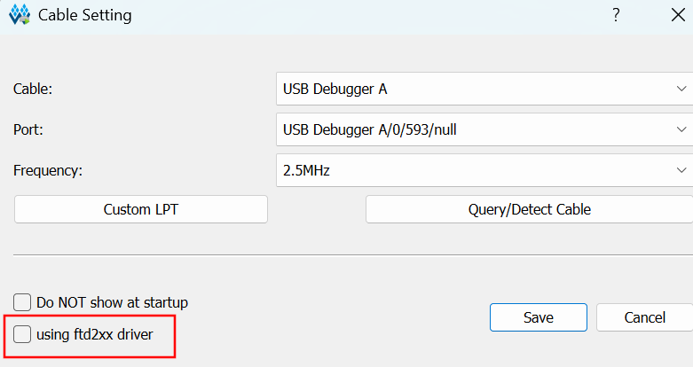
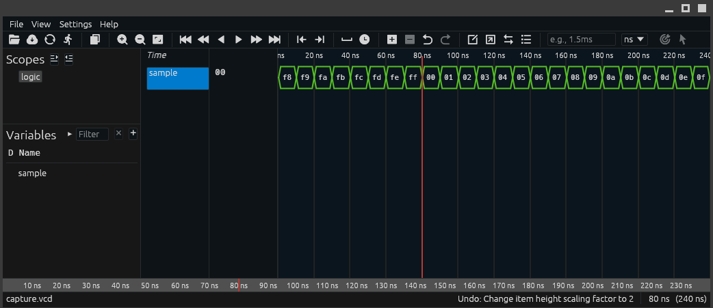
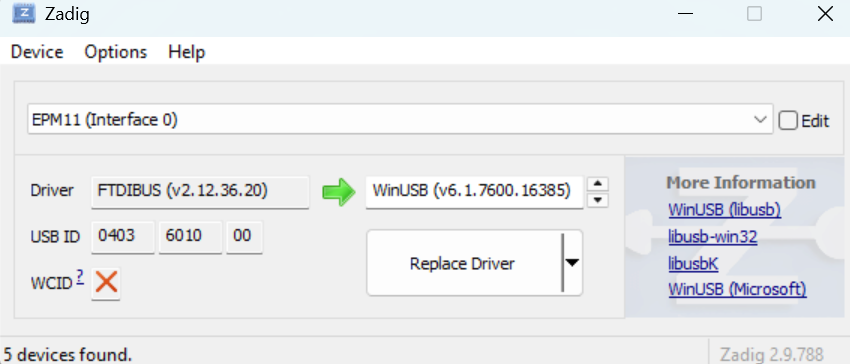

# EPM11


Example project for the [EPM11](https://brisbanesilicon.com.au/epm11) MCU-FPGA development board by [BrisbaneSilicon](https://brisbanesilicon.com.au/).
<br><br>

## Table of Contents

*   [Overview](#overview)
*   [Getting Started](#getting-started)
*   [License Setup](#license-setup)
    *   [Public License Servers](#public-license-servers)
*   [Environment Variables](#environment-variables)
*   [Build](#build)
*   [Program](#program)
*   [Demonstration](#demonstration)
*   [Embedded Logic Analyzer](#embedded-logic-analyzer)
*   [Development](#development)
*   [Documentation](#documentation)
*   [Roadmap](#roadmap)
*   [HowTo](#howto)
    *   [WINUSB Setup](#winusb-setup)
    *   [FTDI Setup](#ftdi-setup)
    *   [OpenOCD Setup](#openocd-setup)
    *   [FcapZ Setup](#fcapz-setup)
<br>

## Overview

This project allows the user to build an FPGA bitstream and program it onto the [EPM11](https://brisbanesilicon.com.au/epm11) MCU-FPGA development board.

It can also be extended by the user to include their custom, application-specific, RTL modules.

The project workflow is fully scripted (fetch, build, program); it does not require the use of a GUI-based program at any point.
<br><br>

## Getting Started

Fulfill the below prerequisites.

### Prerequisites

1. A PC running an x64 compatible, Debian-based flavour of Linux or Windows 11.
   - Other flavours of Linux may work but aren't officially supported.
   - We recommend [Ubuntu](https://ubuntu.com/).
2. An installation of [GIT](https://git-scm.com/).
3. An installation of GOWIN EDA V1.9.12.
   - Available from the official GOWIN EDA [download page](https://www.gowinsemi.com/en/support/download_eda/) or via direct links, [Linux](https://cdn.gowinsemi.com.cn/Gowin_V1.9.12_linux.tar.gz) [Windows](https://cdn.gowinsemi.com.cn/Gowin_V1.9.12_x64_win.zip).
   - You may need to first register as a GOWIN member [here](https://www.gowinsemi.com/en/member/).
   - On Linux, please ensure that GOWIN EDA is installed to one of the following directories (or be prepared to modify the build script):
     - `$HOME/Applications` `/opt/gowin` `/opt/GOWIN` `/opt/Gowin` `$HOME/Documents/Applications/`
   - On Windows, please ensure that GOWIN EDA is installed to one of the following directories (or be prepared to modify the build script):
      - `C:\Gowin`, `C:\Program Files\Gowin`
4. A free license for GOWIN EDA. See section [License Setup](#license-setup) below.
5. A copy of this repository.
   - Launch a terminal program.
   - Navigate to the directory in which you wish to host the EPM11 repository.
   - `git clone https://github.com/BrisbaneSilicon/EPM11-FPGA.git`<br>

### Other

1. On Linux, an FTDI driver is required to communicate with the EPM11 via UART. On most Linux distributions they are part of the default installation of the OS (sudo modprobe ftdi_sio), however you may need to install the driver from [here](https://ftdichip.com/drivers/vcp-drivers/).
2. If you want to program the EPM11 via the 'program.ps1' script on Windows (or probe an ELA, see section [Embedded Logic Analyzer](#embedded-logic-analyzer)) you will need to utilize the WINUSB driver (instead of an FTDI driver). To install WINUSB for the EPM11 on Windows, see section [WINUSB Setup](#winusb-setup).
3. If you wish to use an FTDI driver with the EPM11 on Windows (i.e. no requirement for ELA usage), see section [FTDI Setup](#ftdi-setup).

<br>

## License Setup

There are two options (both free) for licensing GOWIN EDA.
1. Using a local license file.
2. Using a floating license server.

Option (1) requires applying for a license from GOWIN [here](https://www.gowinsemi.com/en/support/license/). It can take up to a few working days for GOWIN to provide you with a license, which will be valid for a period of one year. Option (2) requires the same initial step if you wish to host your own license server. Alternatively you can point the GOWIN license manager at a public license server; this is likely the quickest path forwards. See [Public License Servers](#public-license-servers) for a list of public license servers.

### Linux

Launch a bash terminal and perform the following:

1. Change directory to the GOWIN IDE installation 'bin' directory.
   - `cd <GOWIN IDE install directory>/IDE/bin/`
2. Run the licensing manager.
   - `./license_config_gui`
   - Alternatively you can run the GOWIN IDE `./gw_ide` and click 'Help' - 'Manage License'.
3. Either point the licensing manager at your local license file (Option 1 above) or a floating license server.
4. Press 'Check' to validate the license.
   - If the license has been successfully validated, it should produce a popup window __INFO__ with the message __Server is OK__.
5. Click 'Save' to save your license setup.
<br>

> [!WARNING]
> Sometimes the first license check (step 4) will fail - simply repeat the step to validate the license.

### Windows

To configure the license on Windows GOWIN EDA:

1. Open GOWIN EDA (`gw_ide.exe`) from your install directory.
2. Click 'Help' - 'Manage License'.
3. Either point the licensing manager at your local license file (Option 1 above) or a floating license server.
4. Press 'Check' to validate the license.
   - If the license has been successfully validated, it should produce a popup window __INFO__ with the message __Server is OK__.
5. Click 'Save' to save your license setup.
<br>

> [!WARNING]
> Sometimes the first license check (step 4) will fail - simply repeat the step to validate the license.

### Public License Servers

A list of public GOWIN EDA license servers is below. These are community reported and might not be official or stable (see the previous instructions on how to check their validity).

| IP Address | Port |
| :------: | :------: |
| 106.55.34.119 | 10559 |
| 43.128.7.128 | 10559 |

<br>

## Environment Variables

### Linux

1. Prior to building the project, set 'LD_LIBRARY_PATH' to point at the GOWIN IDE libraries at `<GOWIN IDE install directory>/IDE/lib`. For example:
```bash
export LD_LIBRARY_PATH=/opt/Gowin/Gowin_V1.9.12_linux/IDE/lib
```
2. Prior to programing the EPM11 board, add `<GOWIN IDE install directory>/Programmer/bin/` to your PATH. For example:
```bash
export PATH=$PATH:/opt/Gowin/Gowin_V1.9.12_linux/Programmer/bin/
```

<br>

> [!WARNING]
> When attempting to build the project, you may get the following error:
> ```bash
> symbol lookup error: /<system library path>/libfontconfig.so.1: undefined symbol: FT_Done_MM_Var.
> ```
> To rectify this, setup the following environment variable as part of your pre-build environment, substituting '\<system library path>' to be as per your specific error message:
> ```bash
> export LD_PRELOAD=$LD_PRELOAD:/<system library path>/libfreetype.so
> ```
> 
> When attempting to program the board, you may get the following error:
> ```bash
> programmer_cli: /<GOWIN EDA install path>/Programmer/bin/libz.so.1: version `ZLIB_1.2.3.4' not found (required by /lib/x86_64-linux-gnu/libpng16.so.16)
> ```
> To rectify this, setup the following environment variable as part of your pre-build environment:
> ```bash
> export LD_PRELOAD=$LD_PRELOAD:/<system library path>/libz.so.1
> ```
> Note that the '\<system library path>' may differ from the build error - you might need to use the 'ldd' program to locate libz.so.1.

<br>

> [!NOTE]
> If you are going to be building the project often, we recommend (on Linux) you add a bash alias for the above environment variables to your '.bashrc'. For example: <br>
> ```bash
> alias gowin_ini='export LD_LIBRARY_PATH=/opt/Gowin/Gowin_V1.9.12_linux/IDE/lib; \
> export PATH=$PATH:/opt/Gowin/Gowin_V1.9.12_linux/Programmer/bin/; export \
> LD_PRELOAD=/lib/x86_64-linux-gnu/libfreetype.so'
> ```

Then to initialise the build environment, you can simply run `gowin_ini' from bash.

### Windows

#### PowerShell Execution Policy

The scripts require PowerShell's execution policy to be set to `RemoteSigned` or higher. To check your current policy:

```powershell
Get-ExecutionPolicy
```

If it does not return `RemoteSigned` or `Unrestricted`, open PowerShell as Administrator and run:

```powershell
Set-ExecutionPolicy RemoteSigned
```

Or for current user only:
```powershell
Set-ExecutionPolicy -ExecutionPolicy RemoteSigned -Scope CurrentUser
```

<br>

## Build

After fulfilling all of the prerequisites, and initializing your build environment, you are ready to build the EPM11 firmware! Simply perform the following:

### Linux

```bash
cd <this repository directory>/build
./build.sh
```

That's all there is to it!<br><br>

The build script supports various customizations via command line arguments. To view the full set of supported command line arguments, simply perform the following:
```bash
./build.sh -h
```
<br>

The most commonly used are listed below.
<br>

| Build Argument | Description |
| :----------: | :----------: |
| -p, --proj_only | Only generate the project file, then exit. Useful if the user wishes to utilize GOWIN IDE.|
| -s, --synth_only | Only proceed with build until synthesis is complete, then exit. Useful to check FPGA utilization, timing etc. |
| -y, --list_supported_system_clock_frequencies | List the supported system clock frequencies and exit. |
| -k, --clock_frequency FREQUENCY_MHZ | Use a frequency of FREQUENCY_MHZ for the system clock (default 51 MHz). |
| -e, --embedded_logic_analyzer| Include an Embedded Logic Analyzer (fpgacapZero) in the bitstream. |
| -a, --clean_all_platforms | Perform cleanup of the entire build and exit. |

### Windows

Open PowerShell (Admin not required), `cd` into the repository root, then the 'build' directory, and then run:

```powershell
.\build.ps1
```
<br><br>

## Program

After building the EPM11 firmware you are ready to program it to the board! It is worth noting that this stage also programs the internal non-volatile bitstream flash, so your firmware will auto-load after board power on! <br><br>After plugging the board into your PC via the USB-C cable, simply perform the following:

### Linux

The '\<this repository directory>' is the directory in which you performed Step (4) of [prerequisites](#prerequisites) - i.e. the directory in which you cloned this repository.

```bash
cd <this repository directory>/prog
./program.sh
```
<br>

That's all there is to it!
<br>

> [!NOTE]
> The 'program' script will trigger a build the EPM11 firmware (with no command line customization arguments) if it detects it hasn't already been built.
<br>

Again, the program script supports various customizations via command line arguments. To view the full set of supported command line arguments, simply perform the following:

```bash
./program.sh -h
```
<br>
The most commonly used are listed below.
<br>

| Program Argument | Description |
| :----------: | :----------: |
| -f, --program_flash | Program the EPM11 embedded Flash, as opposed to the SRAM (default). |
| -d, --list_default_target | List the default build target. |
| -c, --clean_target_prior | Clean TARGET build prior to building and programming the EPM11 board. |
| -b, --check_if_target_built | Print firmware built status of provided target board and exit. |
| -t, --custom_target_device CUSTOM_TARGET | Instead of the default target, target 'CUSTOM_TARGET'. |
| -o, --open_fpga_loader CUSTOM_TARGET | Program the EPM11 using 'openFPGALoader' instead of the GoWIN toolchain (Linux only). |
<br>

> [!WARNING]
> If you have previously loaded an FTDI driver in order to utilise the user comms, you will need to remove it prior to programming the board:
> ```bash
> sudo rmmod ftdi_sio
> ```

### Windows

#### Program Board

> [!WARNING]
> Make sure there are no conflicts between FTDI driver versions before running this script — see [Other](#ftdi-driver-setup).

The '\<this repository directory>' is the directory in which you performed Step (4) of [prerequisites](#prerequisites) - i.e. the directory in which you cloned this repository.

```powershell
cd '<this repository directory>\prog\'
.\program_board.ps1
```


> [!NOTE]
> After printing `*** GOWIN programmer_cli Command Line Console ***`, the script may appear to hang with no further output for approximately 3 seconds. The script detects the hang automatically, kills `programmer_cli.exe`, and retries the programming command in a fresh hidden console (up to two retries). Most stalls are recovered automatically without user intervention.

If all three attempts stall, the script prints `PROGRAMMING FAILED (stalled)`. To recover:
1. Unplug the USB-C cable from the board.
2. Wait 3-5 seconds for the FTDI chip to fully power down and clear its state.
3. Plug the USB-C cable back in.
4. Run the programming script again.

For more detailed windows troubleshooting steps, see TROUBLESHOOTING.txt.

`programmer_cli.exe` is killed automatically. You shouldn't need to manually kill it in Task Manager.
<br><br>
> [!NOTE]
> If you use GOWIN EDA or GOWIN Programmer to flash the EPM11, ensure that you connect to the board with 'using ftd2xx driver' unselected:



<br><br>

## Demonstration

> [!NOTE]
> TODO - describe how to read FPGA version string via MCU

<br>

## Embedded Logic Analyzer

This project can be built to include an Embedded Logic Analyzer to showcase injecting and probing an fpgacapZero ELA core. Ensure you have completed [OpenOCD Setup](#openocd-setup) and [FcapZ Setup](#fcapz-setup) and pulled the 'fpgaCapZero' foreign git submodule (command below) prior to performing the steps below.
```bash
cd <this repository directory>
git submodule update --init
```

To inject an ELA core into the firmware, build the firmware with the '-e' command line argument (below) and then program the board as per [program](#program).<br>
```bash
./build.sh -e
```
Once the board has been programmed, run OpenOCD as per [OpenOCD Setup](#openocd-setup), and then probe the ELA core via fpgacapZ:<br>
```bash
fcapz --backend openocd --port 6666 --tap GW1NR-9C.tap probe
```
This should produce the following:
```
{
  "version_major": 0,
  "version_minor": 4,
  "core_id": 19521,
  "sample_width": 8,
  "depth": 64,
  "num_channels": 6,
  "trig_stages": 1,
  "has_storage_qualification": false,
  "has_decimation": false,
  "has_ext_trigger": false,
  "has_timestamp": false,
  "timestamp_width": 0,
  "num_segments": 1,
  "probe_mux_w": 0,
  "compare_caps": 197059,
  "compare_modes": [
    0,
    1,
    6,
    7,
    8
  ],
  "has_dual_compare": true
}
```
Next, trigger on Channel 3 (index 2), which is an 8-bit counter (see the 'autogen_top_wrapper.sv' that was built).
```
fcapz --backend openocd --port 6666 --tap GW1NR-9C.tap capture --pretrigger 8 --posttrigger 16 --trigger-mode value_match --trigger-value 0 --depth 64 --format vcd --out capture.vcd --channel 2
```
Open the resulting capture (note the trigger location, and depth) in a waveform viewer, for example, [surfer](https://surfer-project.org/):
```
surfer capture.vcd
```


See the table below for details on the captured channels. Note that you can manually trigger the ELA via:

1. Holding Pushbutton 2.
2. Running the 'fcapz' command, triggering on Channel 4 as '0'.
3. Releasing Pushbutton 2.

| Build Switches | fcapZ CH1 | fcapZ CH2 | fcapZ CH3 | fcapZ CH4 | fcapZ CH5 | fcapZ CH6|
| :------:|:------:|:------:|:------:|:------:|:------:|:------:|
| ./build.sh -e |FPGA Pin 1-8 State|FPGA Pin 9-16 State|8-bit Counter|Button 2 State|0|0|


<br>

## Development

Extending the project with your custom firmware is quite straightforward, simply modify the __user.sv__ file (located in \<this repository directory>/proj/common/systemverilog/). You can also instantiate your own Systemverilog or VHDL modules, but ensure you add them to the appropriate build script file __synth.tcl__ ('scripts' directories).

Further information related to user development with the EPM11 is detailed official documentation, see section [documentation](#documentation) below.

<br>

## Documentation

Official documentation for the EPM11 is available [here](https://brisbanesilicon.com.au/docs/EPM11_Datasheet.pdf).

<br>

## HowTo

This section details the installation and setup of external requirements / tools.

### WINUSB Setup

To install the WINUSB driver for the EPM11 on Windows, perform the below steps.

1. Download and install the latest version of the Zadig utility [here](https://zadig.akeo.ie/). If that link is broken, use the version in this repository (under foreign/zadig).
2. Connect the EPM11 to your PC.
3. Run Zadig as Administrator.
4. From the top menu, click 'Options' and check 'List All Devices'.
5. Select 'EPM11 (Interface 0)' from the drop down.
6. Click 'Replace Driver' as per the below image.



<br>

### FTDI Setup

On Windows, you may need to install the driver from [here](https://ftdichip.com/drivers/vcp-drivers/). FTDI also provide installation guides, available [here](https://ftdichip.com/document/installation-guides/).
4. Windows version require matching FTDI driver versions, if you already have FTDI installed earlier. Mismatched FTDI driver versions can cause Windows to crash with `KERNEL_SECURITY_CHECK_FAILURE (0x139)`.

To check for driver conflicts, run:
```powershell
pnputil /enum-drivers | Select-String -Pattern "ftdi" -Context 5
```
Ensure all listed driver versions match. If they do not, follow the full FTDI reinstall procedure: 

   1. Remove all FTDI devices and drivers
    Open Device Manager (devmgmt.msc), then enable hidden devices via View > Show hidden devices. Look under:
```
    "Universal Serial Bus controllers" — any FTDI entries
    "Ports (COM & LPT)" — any "USB Serial Port" entries
    "USB Debugger A" entries
    "USB Serial Converter" entries
```

  Right-click each device > Uninstall device > check "Attempt to remove the driver for this device".


   2. Clear ghost devices

  With the board unplugged, open an admin PowerShell:

  ```pnputil /enum-drivers | Select-String -Pattern "ftdi" -Context 5```

  This lists any FTDI drivers still in the driver store. For each one, note the published name (e.g. oem12.inf) and remove it:

  ```pnputil /delete-driver oem12.inf /force```

   3. Clean leftover files

  Check for stale copies:

    Get-ChildItem C:\Windows\System32\drivers\ftd*.sys
    Get-ChildItem C:\Windows\System32\ftd2xx*.dll
    Get-ChildItem C:\Windows\SysWOW64\ftd2xx*.dll

  These should be gone after step 2. If any remain, note the versions (Right-click > Properties > Details > File version) before deleting — this tells you what was installed.

   4. Reboot

    Reboot before reinstalling anything. This ensures the kernel fully unloads the old drivers.

   5. Reinstall clean

  Download the latest D2XX driver from FTDI: https://ftdichip.com/drivers/d2xx-drivers/

  Run the installer. Then plug in the board. Windows should pick up the new drivers.

   6. Verify versions match

  After reinstall, check if the driver versions match by running: 
  ```
  pnputil /enum-drivers | Select-String -Pattern "ftdi" -Context 5
  ```

### OpenOCD Setup

OpenOCD, the Open On-Chip Debugger, is used to connect fpgacapZero to the ELA (Embedded Logic Analyzer). Note that on Windows you must perform [WINUSB Setup](#winusb-setup) prior to setting up OpenOCD.

To install OpenOCD, simply follow the OS-specific instructions [here](https://github.com/openocd-org/openocd/#installing-openocd). Alternatively, if you are on Windows you can download a binary from [here](https://openocd.org/pages/getting-openocd.html). 

To connect OpenOCD to the EPM11, ensure it is plugged into the PC and then run the terminal command(s) below.

```
cd <this repository directory>
openocd -f foreign/openocd/epm11.cfg
```
If OpenOCD has connected successfully, the output will be similar to the following.

```
Open On-Chip Debugger 0.12.0
Licensed under GNU GPL v2
For bug reports, read
	http://openocd.org/doc/doxygen/bugs.html
Info : clock speed 5000 kHz
Info : JTAG tap: GW1NR-9C.tap tap/device found: 0x1100481b (mfg: 0x40d (Gowin Semiconductor Corp), part: 0x1004, ver: 0x1)
Warn : gdb services need one or more targets defined
Info : Listening on port 6666 for tcl connections
Info : Listening on port 4444 for telnet connections
```

### FcapZ Setup

FpgacapZero is an open-source, vendor-agnostic FPGA debug core, an Embedded Logic Analyzer (ELA) for waveform capture, an Embedded I/O (EIO) for runtime read/write of fabric signals.

To install fpgacapZero, simply follow [OpenOCD Setup](#openocd-setup) and then the instructions available [here](https://github.com/lcapossio/fpgacapZero#quick-start). Once fpgacapZero is installed, follow [Embedded Logic Analyzer](#embedded-logic-analyzer) to inject and probe an ELA core.

<br>

## Roadmap


<br>

## Authors

- [@brisbanesilicon](https://github.com/BrisbaneSilicon)

<br>

## Appendix

For developing with the project, we recommend [Sublime Text](https://www.sublimetext.com/), with the VHDL and/or Systemverilog syntax highlighing enabled.<br><br>
If you like this project, follow us on X [here](https://x.com/brisbanesilicon)!
<br>

## Support

For support, email support@brisbanesilicon.com.au.

